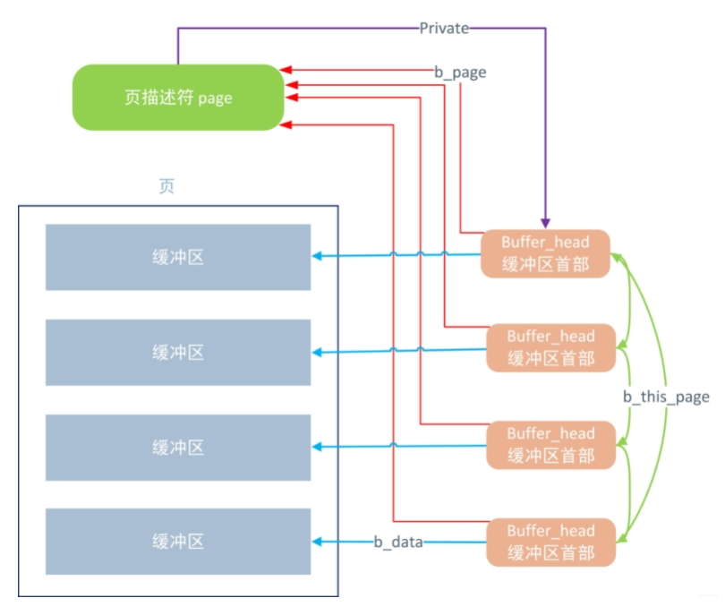
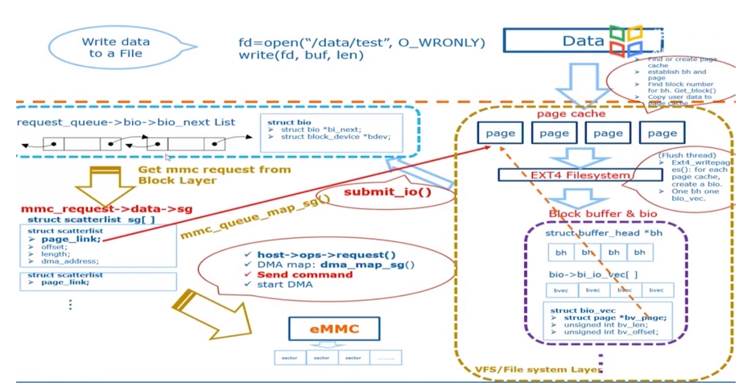

## 从用户程序发起一次IO行为，最终怎么到磁盘
整个过程大致如下图：

user write
	->struct pagecache
		->struct bio
			->struct request
				->磁盘
### write怎么去写
write函数原型：
> ssize_t write(int fd, const void *buf, size_t count);

根据open返回的文件描述符fd执行写入，buf指针指向的是内容，大小为count

-fs/read_write.c

```c
SYSCALL_DEFINE3(write, unsigned int, fd, const char __user *, buf,
		size_t, count)
{
	return ksys_write(fd, buf, count);
}
```
```c
ssize_t ksys_write(unsigned int fd, const char __user *buf, size_t count)
{
	struct fd f = fdget_pos(fd); //得到要操作的文件
	ssize_t ret = -EBADF;

	if (f.file) {
		loff_t pos = file_pos_read(f.file);//需要写文件的位置
		ret = vfs_write(f.file, buf, count, &pos);
		if (ret >= 0)
			file_pos_write(f.file, pos);
		fdput_pos(f);
	}

	return ret;
}
```

```c
ssize_t vfs_write(struct file *file, const char __user *buf, size_t count, loff_t *pos)
{
	ssize_t ret;

	if (!(file->f_mode & FMODE_WRITE))
		return -EBADF;
	if (!(file->f_mode & FMODE_CAN_WRITE))
		return -EINVAL;
	if (unlikely(!access_ok(VERIFY_READ, buf, count)))
		return -EFAULT;
    //验证是否可以操作这个文件
	ret = rw_verify_area(WRITE, file, pos, count);
	if (!ret) {
		if (count > MAX_RW_COUNT)
			count =  MAX_RW_COUNT;
		file_start_write(file);
		ret = __vfs_write(file, buf, count, pos);//写入
		if (ret > 0) {
			fsnotify_modify(file);
			add_wchar(current, ret);
		}
		inc_syscw(current);
		file_end_write(file);
	}

	return ret;
}
```

```c
ssize_t __vfs_write(struct file *file, const char __user *p, size_t count,
		    loff_t *pos)
{   //调用具体文件系统的写函数
	if (file->f_op->write)
		return file->f_op->write(file, p, count, pos);
	else if (file->f_op->write_iter)
		return new_sync_write(file, p, count, pos);
	else
		return -EINVAL;
}
```
write全貌（以ext4文件系统为例）：


### Page cache怎么找
Page cache缓存文件的页以优化文件IO，是内存缓存磁盘的数据；
Buffer cache缓存块设备的块以优化块设备IO。


- 读文件：
    几个磁盘块--->bufferCache--->pageCache--->应用程序进程空间
- 写文件：
    pageCache--->bufferCache--->磁盘

**<font color=#f00000 size = 6>从open到pageCache</font>**
open->int fd
write(fd,buf,count)->fdget_pos(fd)->
struct file->struct inode->struct address_space
每个address_space对象对应一颗基树，一个address_space结构管理了一个文件在内存中缓存的所有pages

```c
struct address_space {
	struct inode		*host;		/* 所属者: inode, block_device */
	struct radix_tree_root	i_pages;	/* 缓存好的页对应的基数树 */
	atomic_t		i_mmap_writable;/* VM_SHARED映射计数 */
	struct rb_root_cached	i_mmap;		/* 私有和共享映射的树 */
	struct rw_semaphore	i_mmap_rwsem;	/* protect tree, count, list */
	/* Protected by the i_pages lock */
	unsigned long		nrpages;	/* 页面的总数 */
	/* number of shadow or DAX exceptional entries */
	unsigned long		nrexceptional;
	pgoff_t			writeback_index;/* 从这里开始回写 */
	const struct address_space_operations *a_ops;	/* 操作方法集 */
	unsigned long		flags;		/* error bits */
	spinlock_t		private_lock;	/* for use by the address_space */
	gfp_t			gfp_mask;	/* implicit gfp mask for allocations */
	struct list_head	private_list;	/* for use by the address_space */
	void			*private_data;	/* ditto */
	errseq_t		wb_err;
} __attribute__((aligned(sizeof(long)))) __randomize_layout;
```
在page cache机制中，每个page都有对应的文件-owner，address_space将属于同一owner的pages联系起来，并把这些页加到这个onwer对应的基数树中radix_tree。
所以，在调write写入的时候会先在打开的file中寻找自己要写的那个页有没有缓存到page_cache中，没有的话就新建一个page_cache项目，并挂在基数树里。
基数树radix_tree里的各个radix_tree_node结构中，slot字段下就挂着一个个页面page。

```c
struct radix_tree_node {
    unsigned int  height;  /*从叶子节点向上计算的树高度*/
    unsigned int count;    /*非叶子节点包含一个count域，表示出现在该节点的孩子节点的数量*/
    struct rcu_head rcu_head;
    void*  slot[RADIX_TREE_MAP_SIZE];  //64个，该数组中的指针可以指向具体的struct  page结构，也可以指向子节点*/
    unsigned long tags[RADIX_TREE_MAX_TAGS][RADIX_TREE_TAG_LONGS];
};
```
### 怎么确定一页有没有在缓存里？
page结构的mapping字段指向该页所有者的address_space，index字段表示所有
者地址空间中以页大小为单位的偏移量。用这两个字段就能在页高速缓存中查找有没有该页的缓存在。
```c
struct page{
    ...
    struct address_space *mapping;
	pgoff_t index;		/* Our offset within mapping. */
    ...
}
```

**<font color=#f00000 size = 6>从pagecache到bio</font>**
### 块缓冲技术
page_cache是将文件数据放入内存，现在是要将页的数据放入块设备，因此需要用到块缓冲区，每个块缓冲区都对应一个buffer_head结构，此时数据依然存放在page页面中，只不过由buffer_head管理。
定义在buffer_head.h中：
```c
struct buffer_head {
	unsigned long b_state;		/* buffer state bitmap (see above) */
	struct buffer_head *b_this_page;/* 页面缓冲区的循环列表 */
	struct page *b_page;		/* 所映射的页*/

	sector_t b_blocknr;		/* 起始块号 */
	size_t b_size;			/* 映射的大小 */
	char *b_data;			/* 指向页中的数据 */

	struct block_device *b_bdev;
	bh_end_io_t *b_end_io;		/* I/O completion */
 	void *b_private;		/* reserved for b_end_io */
	struct list_head b_assoc_buffers; /* associated with another mapping */
	struct address_space *b_assoc_map;	/* mapping this buffer is
						   associated with */
	atomic_t b_count;		/* users using this buffer_head */
};
```
为什么要由buffer_head管理呢？
内存中一个page所包含的磁盘块在物理上不一定是相邻的，所以就需要buffer_head结构来管理page中这些不同的磁盘块。
网上很多资料说4个buffer_head对应一个page，这是因为考虑的是block=1K的情况。
page结构中的private字段指向其中一个buffer_head:



之后把buffer和inode标记为dirty之后write就结束了。
也就是当write把数据写入到page_cache中，把此页标识为脏后，就返回到用户态了。

### 脏页回写
具体的脏页何时写入磁盘，是内核线程pdflush来负责的。
flushe线程在文件mm/page-writeback.c和mm/backing-dev.c中，回写机制实现在fs/fs-writeback.c中。

回写机制中调用do_writepages将脏页写到磁盘，在page-writeback.c中可以看到它的定义：
```c
int do_writepages(struct address_space *mapping, struct writeback_control *wbc)
{
	int ret;

	if (wbc->nr_to_write <= 0)
		return 0;
	while (1) {
		if (mapping->a_ops->writepages)
			ret = mapping->a_ops->writepages(mapping, wbc);
		else
			ret = generic_writepages(mapping, wbc);
		if ((ret != -ENOMEM) || (wbc->sync_mode != WB_SYNC_ALL))
			break;
		cond_resched();
		congestion_wait(BLK_RW_ASYNC, HZ/50);
	}
```
a_ops是地址空间的操作方法集，通过a_ops->writepages可以调用不同文件系统回写方法，如ext4的为：
> static const struct address_space_operations ext4_aops = {
        .readpage       = ext4_readpage,
        .readpages      = ext4_readpages,
        .writepage      = ext4_writepage,
        .writepages     = ext4_writepages,}

在fs/ext4/inode.c中看到ext4_writepage把page转换为buffer_head:
> struct buffer_head *page_bufs = NULL;
> page_bufs = page_buffers(page);

几个buffer_head并为一个bio--submit_bh
```c
int submit_bh(int rw, struct buffer_head * bh)
{
    struct bio *bio;
    ...
    bio = bio_alloc(GFP_NOIO, 1);
    /*根据buffer_head(bh)构造bio */
    bio->bi_sector = bh->b_blocknr * (bh->b_size >> 9);   //存放逻辑块号
    bio->bi_bdev = bh->b_bdev;                            //存放对应的块设备
    bio->bi_io_vec[0].bv_page = bh->b_page;
    bio->bi_io_vec[0].bv_len = bh->b_size;                //存放扇区的大小
    bio->bi_io_vec[0].bv_offset = bh_offset(bh);          //存放扇区中以字节为单位的偏移量

    bio->bi_vcnt = 1;
    bio->bi_idx = 0;
    bio->bi_size = bh->b_size;                           //存放扇区的大小

    bio->bi_end_io = end_bio_bh_io_sync;                 //设置I/O回调函数
    bio->bi_private = bh;

    ...
    submit_bio(rw, bio);                                //提交bio
    ...
}
```
这就相当于给每个page_cache分配了几个对应的buffer_head，给每个buffer_head分配一个bi_io_vec，让他们聚合成一个bio结构体。

**<font color=#f00000 size = 6>从bio到request</font>**
最后把bio交给block layer层--submit_bio
```c
void submit_bio(int rw, struct bio *bio)
{
    ...
    generic_make_request(bio);
}
```

到这里文件系统的使命就完成了，之后block layer层会把发来的bio链成表，放在request_queue队列里，驱动程序从请求队列request_queue取到request来处理就可以了。

#### 易混淆数据结构
- struct gendisk：描述块设备；
- struct block_device：是对块设备或设备分区的抽象，一个gendisk对象会关联到一个block_device对象，也就是说block_device是为了让内核可以使用这个块设备而存在的，只是提供了对块设备的使用方式。而通过block_device来访问块设备，其最终也要转换为对对应的gendisk的访问；
- struct block_device_opeations：块设备支持的设备操作；
- struct bio：表示block_device的读写请求，内核用一个bio的结构体来描述一次块IO操作；
- struct request：表示等待处理的块设备I/O请求，每个请求包含一个或多个bio结构，bio之间用有序链表连接起来；
- struct request_queue：io请求request所形成的队列；

#### bio合并-电梯调度算法
可以把多个IO请求合并为一个(IO读写属性要一致)，这些IO读写的磁盘扇区地址范围首尾相邻，这样只用进行一次IO磁盘数据传输。
比如有三个IO请求IO1、IO2、IO3，读写的磁盘扇区地址范围分别是0–10，10–15，15–25，如果把这3个IO合并成一个新的IO，对应的磁盘扇区地址范围0–25，之后只用进行一次实际的磁盘数据传输就行，否则就得针对IO0、IO1、IO3分别进行3次实际的磁盘数据传输。
所谓的电梯调度算法就是IO调度算法，这其实也是整个IO系统的核心所在，elv_merge中有以下几种类型：
```c
enum elv_merge {
	ELEVATOR_NO_MERGE	= 0,
	ELEVATOR_FRONT_MERGE	= 1,
	ELEVATOR_BACK_MERGE	= 2,
	ELEVATOR_DISCARD_MERGE	= 3,
};
```

- 无法合并：该bio无法与任何request进行合并；
- 向后合并：该bio可以合并至某个request的尾部；
- 向前合并：该bio可以合并至某个request的头部；
- 丢弃合并：取消该bio的合并操作。

Linux中IO调度的电梯算法有好如下几种：as(Anticipatory)、cfq(Complete Fairness Queueing)、deadline、noop(No Operation)。具体使用哪种算法我们可以在启动的时候通过内核参数elevator来指定，默认使用的算法是cfq。
- NOOP算法：
该算法实现了最最简单的FIFO队列，所有IO请求大致按照先来后到的顺序进行操作。
- CFQ算法
该算法的特点是按照IO请求的地址进行排序，而不是按照先来后到的顺序来进行响应。CFQ为每个进程/线程，单独创建一个队列来管理该进程所产生的请求，也就是说每个进程一个队列，各队列之间的调度使用时间片来调度，以此来保证每个进程都能被很好的分配到I/O带宽。
- DEADLINE算法
DEADLINE在CFQ的基础上，解决了IO请求饿死的极端情况。除了CFQ本身具有的IO排序队列之外，DEADLINE额外分别为读IO和写IO提供了FIFO队列。读FIFO队列的最大等待时间为500ms，写FIFO队列的最大等待时间为5s。FIFO队列内的IO请求优先级要比CFQ队列中的高，而读FIFO队列的优先级又比写FIFO队列的优先级高。优先级可以表示为：
FIFO(Read) > FIFO(Write) > CFQ
Deadline确保了在一个截止时间内服务请求，这个截止时间是可调整的，而默认读期限短于写期限。这样就防止了写操作因为不能被读取而饿死的现象。
- ANTICIPATORY算法
为了满足随机IO和顺序IO混合的场景，ANTICIPATORY的在DEADLINE的基础上，为每个读IO都设置了6ms的等待时间窗口。如果在这6ms内OS收到了相邻位置的读IO请求，就可以立即满足。


***
综上整个过程如下：




***
在我们编写的块设备驱动中，用的是自定义的my_request函数，写入的动作是由memcpy完成的。
> memcpy(ptr, bio_data(rq->bio), size);