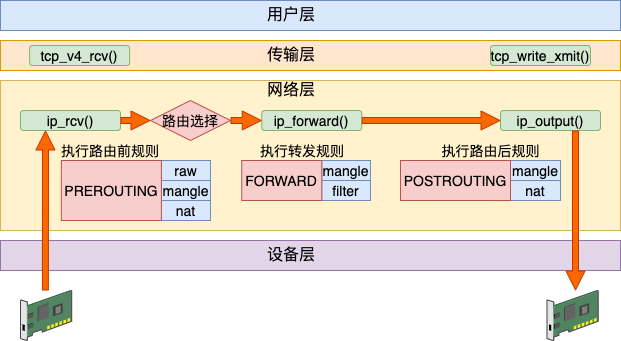

netfilter 在内核协议栈的各个重要关卡埋下了五个钩子。每一个钩子都对应是一系列规则，以链表的形式存在，所以俗称五链。当网络包在协议栈中流转到这些关卡的时候，就会依次执行在这些钩子上注册的各种规则，进而实现对网络包的各种处理。

### 接收过程

在网络包接收在 IP 层的入口函数是 ip_rcv。

```c
int ip_rcv(struct sk_buff *skb, ......){
    ......
    return NF_HOOK(NFPROTO_IPV4, NF_INET_PRE_ROUTING, skb, dev, NULL,
               ip_rcv_finish);

}
```

`NF_HOOK` 函数会执行到 iptables 中 pre_routing 里的各种表注册的各种规则。当处理完后，进入 `ip_rcv_finish`。在这里函数里将进行路由选择。

```c
static int ip_rcv_finish(struct sk_buff *skb){
    ...
    if (!skb_dst(skb)) {
        int err = ip_route_input_noref(skb, iph->daddr, iph->saddr,
                           iph->tos, skb->dev);
        ...
    }
    ...
    return dst_input(skb);

}
```

如果发现是本地设备上的接收，会进入 `ip_local_deliver` 函数。接着是又会执行到 LOCAL_IN 钩子，也就是INPUT 链。

```c
int ip_local_deliver(struct sk_buff *skb){
 ......
    return NF_HOOK(NFPROTO_IPV4, NF_INET_LOCAL_IN, skb, skb->dev, NULL,
               ip_local_deliver_finish);

}
```

接收数据的处理流程是：PREROUTING链 -> 路由判断（是本机）-> INPUT链 -> ...


### 转发过程

当转发数据包时，先是经历接收数据的前半段。在 ip_rcv 中经过 PREROUTING 链，然后路由后发现不是本设备的包，那就进入 ip_forward 函数进行转发，在这里又会遇到 FORWARD 链。最后还会进入 ip_output 进行真正的发送，遇到 POSTROUTING 链。



### Ref

https://mp.weixin.qq.com/s/ZyZ_VpsewX5b2E-fwtGgsg