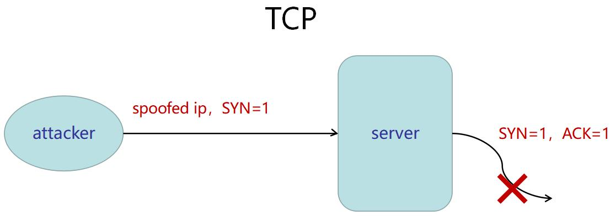

## 概述
基于源ip计数的方式能够防御攻击者源ip固定的攻击，但无法应对攻击者伪造源ip的情况。为解决此问题，可以强制DNS请求使用TCP协议。

### 伪造源ip
DDoS发起者为了隐藏自己的身份/冒充其他合法用户，篡改数据包的源ip，从而掩饰恶意流量的来源以规避防御措施。
> DDoS attacks will often utilize spoofing with a goal of overwhelming a target with traffic while masking the identity of the malicious source, preventing mitigation efforts. If the source IP address is falsified and continuously randomized, blocking malicious requests becomes difficult. IP spoofing also makes it tough for law enforcement and cyber security teams to track down the perpetrator of the attack.

### 防御伪造源ip的DNS DDoS
伪造源ip的行为在UDP协议的DDoS攻击中很容易实现，因为UDP没有TCP的三次握手建立连接的过程，攻击者只需“无脑”修改源ip并发送，导致接收端难以验证源ip的真实性。



DNS使用的正是UDP协议，所以也面临伪造源ip的问题。

#### DNS传输协议
事实上，DNS是同时支持TCP和UDP的，这是DNS协议在设计之初就明确规定的。

在早期，DNS在绝大多数的场景中都使用UDP进行数据传输（最大512字节），只有在DNS服务器之间的区域传输中才会使用TCP。
> DNS 查询可以通过 UDP 数据包或者 TCP 连接进行传输；
由于 DNS 区域传输的功能对于数据的准确有着较强的需求，所以我们必须使用 TCP 或者其他的可靠协议来处理 AXFR 类型的请求；

随着互联网的发展，ipv6的引入、鉴权、安全方面的要求等使得DNS记录变得越来越大，由于UDP响应最大不能超过 512 字节，很多时候需要使用TCP来传输。[RFC7766](https://www.rfc-editor.org/rfc/rfc7766 "RFC7766") 中规定：
> 所有通用 DNS 实现必须要同时支持 UDP 和 TCP 传输协议，其中包括权威服务器、递归服务器以及存根解析器

#### 强制DNS使用TCP协议
所以，回到DNS DDoS中，是否可以强制客户端使用TCP协议发送DNS请求，以避免伪造源ip的DNS DDoS攻击？

DNS是支持这种机制的

DNS报文的格式如下：


在Header中，有一个字段TC（Truncated），代表此次响应是否被截断：


如果TC为1，则代表此次响应被截断（大于512字节），客户端在收到响应后，如果发现TC为1，需要将传输协议切换为TCP重新发送刚才的请求
> When a DNS client receives a reply with TC set, it should ignore that response, and query again, using a mechanism, such as a TCP connection, that will permit larger replies.

换句话说，初始时客户端使用UDP向DNS服务器发送请求，DNS服务器只要在响应中将TC设为1，就可以强制客户端使用TCP，从而防御伪造源ip的攻击

#### 使用XDP_TX快速返回
按照上述思路，可以在XDP程序中将TC置为1，并返回XDP_TX，无需进入内核协议栈，快速返回响应

在XDP程序中具体需要修改的内容为：

- 2层：交换源mac与目的mac
- 3层：交换源ip与目的ip，重新计算校验和
- 4层：交换源端口与目的端口，重新计算校验和
- 7层：在DNS的Header中设置TC=1，QR=1


## 实践

### 前提
内核版本>=5.4，更低版本未验证

已安装：
- Docker
- dig（DNS客户端，用于测试）

### 快速开始
1. 构建测试镜像
```sh
make builder
```
demo的所有依赖都包含在docker镜像中，不需要在宿主机中安装

2. 运行DNS服务器，并加载eBPF程序
```sh
make test
```
此时已在本机用docker运行了一个DNS服务器，可以使用dig命令测试DNS服务器是否正常运行
```sh
dig @localhost gateway.example.com +retry=0
```

3. 强制使用TCP
```sh
make enforce-tcp
```
这意味着DNS服务器将只接收TCP请求，此时再发送DNS请求：
```sh
dig @localhost gateway.example.com +retry=0
```
会发现响应中包含“**retrying in TCP mode**”
```sh
dig @localhost gateway.example.com +retry=0
;; Warning: Message parser reports malformed message packet.
;; Truncated, retrying in TCP mode.

; <<>> DiG 9.11.4-P2-RedHat-9.11.4-26.P2.el7_9.9 <<>> @localhost gateway.example.com +retry=0
```

4. 恢复至UDP
```sh
make remove-enforce-tcp
```
将恢复至原来的UDP请求方式，此时再发送DNS请求：
```sh
dig @localhost gateway.example.com +retry=0
```
会发现响应中不再包含“**retrying in TCP mode**”
```sh
dig @localhost gateway.example.com +retry=0
; <<>> DiG 9.11.4-P2-RedHat-9.11.4-26.P2.el7_9.9 <<>> @localhost gateway.example.com +retry=0
```

5. 清理测试环境
```sh
make clean-test
```

## 参考
[1] https://www.cloudflare.com/learning/ddos/glossary/ip-spoofing/

[2] https://draveness.me/whys-the-design-dns-udp-tcp/

[3] https://www.ietf.org/rfc/rfc2181.txt

[4] https://www.rfc-editor.org/rfc/rfc5966

[5] https://mislove.org/teaching/cs4700/spring11/handouts/project1-primer.pdf
